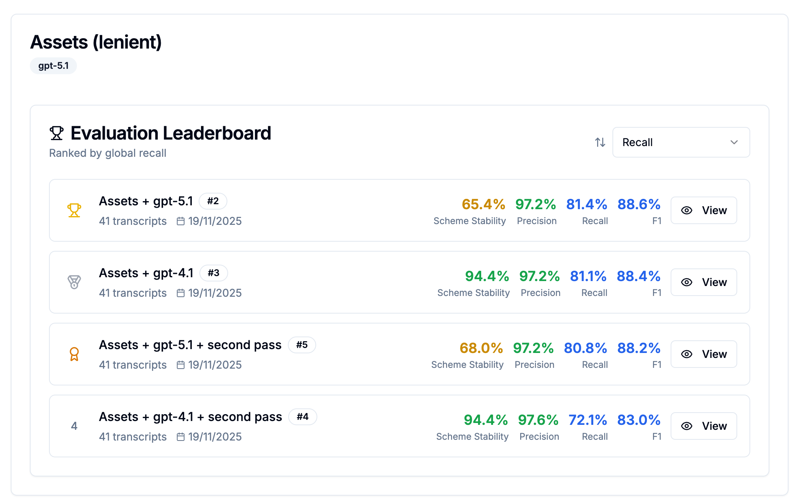
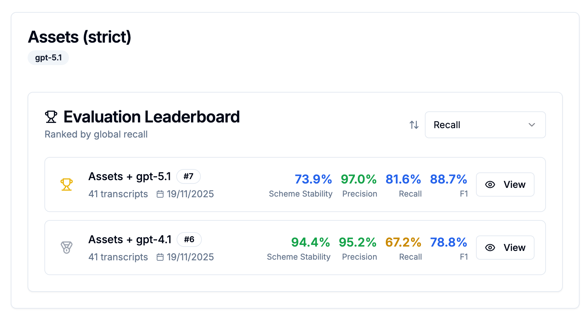
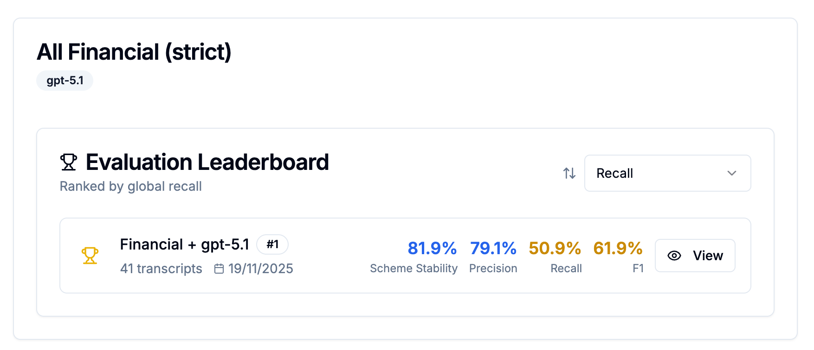

## Results

This project uses the **LLM-as-a-judge approach** to evaluate how well Large Language Models extract structured financial data from advisor-client conversations. 

Ground truth facts are generated using the LLM with a deliberately simple structured output schema that only captures fact descriptions and types, without enforcing the complex structure. This prevents bias toward any particular extraction schema and allows fair evaluation across different extraction approaches. 

The system measures extraction quality through three key metrics:

#### Primary Metrics

<strong>1. Recall (Coverage)</strong> - the most challenging metric

- Measures what percentage of facts present in the transcript were successfully extracted

- Formula: `TP / (TP + FN)` where:
  
  - TP = True Positives (correctly extracted facts)
  - FN = False Negatives (facts present in transcript but not extracted)

<strong>2. Schema Stability</strong>

- Measures consistency of extracted fields across different transcripts which is very important for downstream tasks
- Formula: `(common fields across all transcripts) / (total unique fields across all transcripts)`
- Example: If 3 transcripts extract `{name, age, city}`, `{name, age, country}`, `{name, age, city}` → Stability = 2/4 = 50%
- High stability (>80%) indicates the extraction model reliably captures the same information structure
- Low stability suggests inconsistent extraction patterns that would be difficult to work with in production

<strong>3. Precision</strong>

- Measures what percentage of extracted facts are correct (not hallucinated)
- Formula: `TP / (TP + FP)` where FP = False Positives (extracted facts not supported by transcript)
- **Note:** With current state-of-the-art LLMs (GPT-4o, GPT-5), precision is typically very high (>95%)
- Hallucination is not a major challenge for structured extraction tasks when proper schemas are used

The tables below show extraction results for assets using the same schema across different models, with and without the two-pass extraction approach. The left table uses a **lenient judge** (allows minor variations), while the right table uses a **strict judge** (requires exact matching of all attributes).

**Key observation:** GPT-4.1 demonstrates significantly more consistent schema adherence than GPT-5.1, particularly under strict evaluation. This likely reflects GPT-4.1's longer training period with structured output formats, making it more reliable for production use cases requiring precise data extraction.

**Interesting finding:** Despite GPT-5.1's looser schema adherence, its recall score remains nearly constant between lenient and strict judges. This suggests that while GPT-5.1 may not follow the exact schema structure, it still captures most of the required information content. However, the schema stability score variation between the two leaderboards indicates some inconsistency which seems weird.

|  | |  |
|-------------------|:-:|-------------------|

+ unsuccessful ambitious attempt to cover all financial facts in one schema against a strict judge 

This attempt to extract all financial positions (assets, debts, pensions, incomes, expenses, loans, savings) simultaneously in a single schema demonstrates the practical limits of comprehensive extraction. With strict evaluation criteria, even advanced models struggle to maintain both high recall and schema consistency across such a wide variety of fact types.

#### Why These Metrics Matter

In production financial systems:
- **Low recall** means missing critical client information (income sources, assets, liabilities)
- **Low precision** means unreliable data that could lead to incorrect advice
- **Low schema stability** makes downstream processing and UI development difficult

#### Demo App

**Live:** [https://e4af10f6bf6b.ngrok-free.app/](https://e4af10f6bf6b.ngrok-free.app/)

⚠️ **Note:** This is a adhoc proof-of-concept deployment running on a homeserver with SQLite.

Basic Workflow:

1. **View Transcripts** - Browse generated conversations
2. **Create a Judge** - Define matching rules and entity types
3. **Create an Experiment** - Specify extraction prompt and JSON schema
4. **Run Evaluation** - Judge evaluates experiment on all transcripts
5. **View Results** - Leaderboard with precision/recall/F1, detailed per-transcript breakdowns

#### Why I Built an Application

Show</h4>

While the core research focuses on extraction quality metrics, I developed a full-stack web application for two important reasons:

<h4>Human-in-the-Loop Design</h4>

<strong>The key benefit:</strong> Human-in-the-loop is mainly designed to <strong>identify edge cases</strong> that the current extraction system fails on. By systematically reviewing failures, you can:
- <strong>Target improvements</strong> - Focus prompt engineering on specific problem patterns
- <strong>Gradual quality improvement</strong> - Each iteration fixes known issues without introducing new ones
- <strong>Predictable progress</strong> - Track which edge case categories are resolved vs. remaining
- <strong>Build confidence</strong> - Know exactly which scenarios work and which need human review

The application provides:
- <strong>Ground truth management</strong> - Financial experts can review and edit reference facts per transcript
- <strong>Detailed result viewers</strong> - See exactly which facts were missed (FN) or hallucinated (FP)
- <strong>Manual corrections</strong> - Edit and refine extractions before using them in production

This represents a <strong>proof-of-concept</strong> for a production system where LLMs do the initial extraction and humans verify/correct the results, while also driving systematic improvement of the extraction system over time.

<h4>Experiment Tracking and Visualization</h4>

Systematic research requires careful tracking of:
- <strong>Multiple extraction prompts</strong> - Test different instructions for the LLM
- <strong>Various JSON schemas</strong> - Compare simple vs. complex structured outputs  
- <strong>Different models</strong> - Evaluate GPT-4o vs GPT-5 vs others
- <strong>Judge configurations</strong> - Try strict vs. lenient matching rules

The application provides:
- <strong>Leaderboard</strong> - Rank extraction approaches by F1 score, recall, precision
- <strong>Detailed breakdowns</strong> - Per-transcript results, per-fact-type metrics
- <strong>Schema overlap analysis</strong> - Identify which fields are consistently missed

---

## Future Improvements

### Synthetic Transcript Realism

**Current Issue:**
Generated transcripts are **too information-dense** compared to real advisor-client conversations.

**Potential Solutions:**
1. Add explicit "conversation padding" prompts (small talk, explanations)
2. Post-process to inject realistic gaps and repetitions

### Extraction Quality Improvements

**Current Approach:**
Single LLM call extracts all facts at once from entire transcript.

**Limitations:**
- Long transcripts (10,000+ tokens) exceed effective attention window
- Complex schemas with 100+ fields overwhelm the model
- Subtle facts mentioned briefly get missed (recall problem)

**Proposed Improvements:**
- better schemas
- chunking
- hierarchical extraction
- more granular structured output schemas

### Post-Processing and Validation

After extraction, run automated checks:
- **Missing required fields**: Prompt LLM to fill them specifically
- **Inconsistent dates**: Validate date logic (mortgage start before current date)
- **Numeric anomalies**: Flag unusually large/small values for review
- **Cross-reference checks**: Client age matches pension eligibility

This hybrid approach (LLM extraction + rule-based validation) could catch common errors.

### Ground Truth Quality

**Current Approach:**
Ground truth facts are generated by LLM, not human-annotated.

**Implications:**
- We're evaluating "LLM extraction vs. LLM ground truth"
- Not a true measure of extraction quality against human judgment
- May miss facts that humans would identify but LLMs don't

**Mitigation:**
- Ground truth stored in database and editable by humans
- UI allows manual review and correction
- Human-corrected ground truth can be used for all future evaluations

**Long-term:**
- Hire financial advisors to manually annotate subset of transcripts
- Use human annotations as "gold standard" benchmark
- Current LLM-generated ground truth serves as baseline

----

## Approach

### Synthetic Transcript Generation

I generate realistic financial advisor transcripts using a three-stage pipeline:

1. **Schema Development** - Create and validate a JSON schema that balances completeness with model capability
2. **Prompt Generation** - Create 34 diverse client personas across 17 persona types (young couples, retirees, high earners, etc.) with 2 instances each, covering 7 financial topics: clients information, assets, pensions, incomes, expenses, loans/mortgages, and savings/investments
3. **Transcript Synthesis** - Use GPT-5 to generate natural conversations following persona profiles

**Key characteristics:**
- Natural conversation flow (not rigidly structured by topic)
- Realistic level of specificity - mix of precise details and vague statements to resemble how people actually talk
- 30-60 minute conversation length
- Multiple financial topics per transcript (assets, debts, pensions, income, expenses)

For full details on the generation process, see [preparation/README.md](preparation/README.md).

[Generated example](preparation/generated_example.txt)

You can find more examples in the demo or in the attached Google Drive folder - see the links above.

### Structured Schema Design

The extraction schema balances complexity (capturing detailed financial data) with LLM capability (avoiding overwhelming context).

**Key design principles:**
- **Maximum 5-level nesting depth** - prevents LLM confusion and validation errors. I used 4-level schema.
- **FactValue pattern** - tracks timestamps, citations, estimates, and temporal context for audit trails
- **Advanced JSON Schema features** - uses `$ref`, `allOf`, `anyOf` for reusable, maintainable structure

Iterative refinement process:
1. Used ChatGPT to create a baseline schema (initial version was too permissive)
2. Test extraction on 2 template transcripts with loose schema
3. Analyze field coverage - which fields appear consistently
4. Identify duplicate or redundant fields  
5. Re-run on generated data and refine schema based on stability analysis
6. Re-test until stable results achieved

For complete details on schema constraints and development process, see **[approach.md#structured-schema-design](approach.md#structured-schema-design)**

### 2.3 Evaluation Methodology

The evaluation system uses a **sophisticated dual-pass 1-vs-all judging approach** with deduplication to ensure stable and verifiable TP/FP/FN labels.

**Key features:**
- Ground truth generated with simple schema (prevents bias)
- Each gold fact evaluated individually against all predictions (recall-focused)
- Each predicted fact evaluated individually against all gold facts (precision-focused)
- Conflict resolution and deduplication in code
- Temperature=0 + seed=54321 for full reproducibility
- Reasoning stored for every decision (human-auditable)

For complete details on the evaluation architecture, see **[approach.md](approach.md#evaluation-methodology)**

---

## Getting Started

The project consists of:
- **Transcript generation pipeline** (`preparation/`) - Generate synthetic financial advisor conversations
- **Full-stack evaluation application** (`app/`) - FastAPI backend + Next.js frontend for running experiments

**Quick start:**
1. Set up OpenAI API key
2. Run backend: `cd app/backend && python main.py`
3. Run frontend: `cd app/frontend && npm run dev`
4. Access at http://localhost:9000

For complete setup instructions, project structure, and technology stack, see **[getting_started.md](getting_started.md)**

---

## Key Findings

### What Works Well

1. **Dual-pass 1-vs-all judging** produces consistent, reproducible TP/FP/FN labels
2. **Schema stability** is a useful proxy for extraction reliability
3. **temperature=0 + seed** ensures experimental reproducibility
4. **Structured outputs** dramatically reduce extraction errors vs. free-form JSON

### What Remains Challenging

1. **Recall** for subtle facts mentioned briefly in long transcripts
2. **Schema complexity** - deeper than 5 levels confuses models
3. **Ambiguous facts** - "I have some savings" without specific amounts

### Open Questions

1. Would specialized small models (fine-tuned) outperform general LLMs?
2. What's the optimal extraction prompt format (instructions vs. examples)?
3. How much does judge strictness affect downstream use of extracted data?

